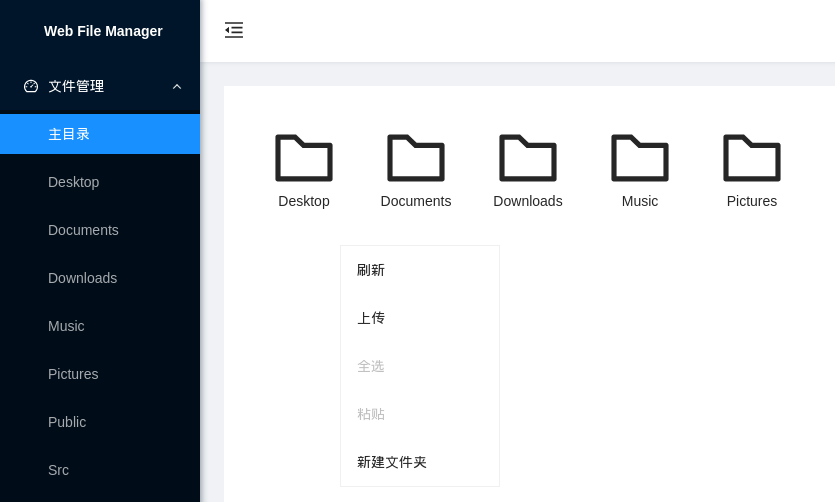

# web-file-manager

## 介绍

简单的在线文件管理器，在浏览器管理文件，并计划支持远程下载，支持桌面和移动端。

## 截图

## 安装

### Use golang

`go install github.com/myml/web-file-manager`

### Use docker/podman

`podman run -d -v $(pwd):/data -p 8080:8080 ghcr.io/myml/web-file-manager:main`

## 使用

### 设置密码
通过环境变量`USER`和`PASSWORD`设置用户名和密码，默认无验证。

### WebUI地址

http://localhost:8080

### WebDAV地址

http://localhost:8080/dav

## 路线图

- [x] 文件查看
- [x] 文件上传
- [x] 文件下载
- [x] 文件夹创建
- [x] 文件删除
- [x] 文件复制
- [ ] 文件选择
- [x] 文件剪贴
- [ ] 文件属性
- [ ] 远程下载
- [ ] bt 下载
- [x] 图片预览
- [x] pdf 预览
- [ ] word 预览
- [ ] tar.gz 预览
- [ ] ssh 文件管理
- [ ] 国际化支持
- [x] systemd socket activation
- [x] WebDAV
